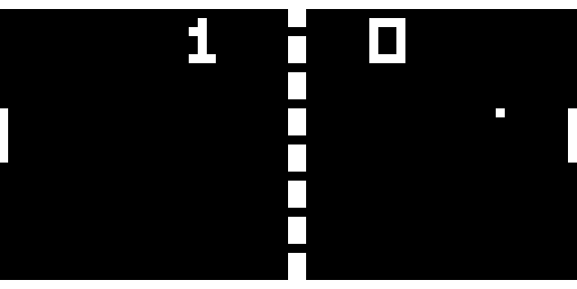

# CHIP-8-emu
My first attempt with emulation. It was focused in the CHIP-8 Virtual Machine, originally developed in the 70's by Joseph Weisbecker.



## Building and Running

#### Prerequisites

* installed [__OpenGL__](https://www.khronos.org/opengl/wiki/Getting_Started) Library

#### Build
```
~$ make
```
#### Run

> syntax: **make run [scale] [delay] [ROM]**


```
~$ make run 10 10 tests/pong2.ch8
```
